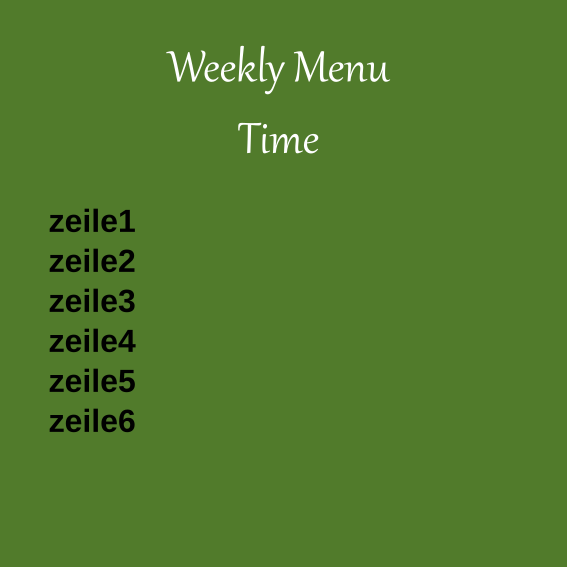
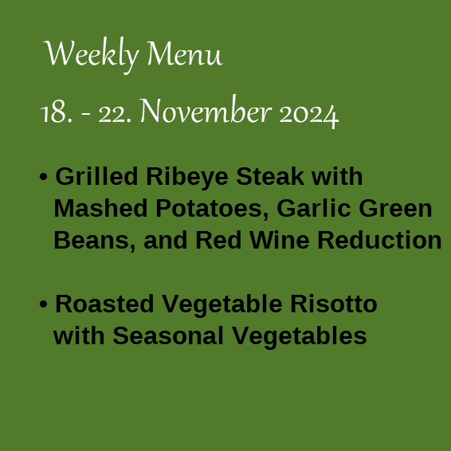

# svg_manipulaton_code
In this project, I automatically alter the text of a restaurant menu in a svg file.

## Table of Contents
1.[Installation](#installation)
2.[Project Motivation](#motivation)
3.[File Descriptions](#files)
4.[Results](#results)
5.[Licensing, Authors, and Acknowledgements](#licensing)

## Installation 

The code is written using Pythons version 3.11.0. All libraries are available within the Anaconda distribution of Python.

## Project Motivation 

To further automate my custom 3D Designs, I wanted to get some knowledge about altering text in svg files. Altering a restaurant menu is a perfect starting project to get used to the basic coding in this area.

## File Descriptions 

update_menu.py: Script that alters Menu template by inserting user inputs about menus and time span of the offer
weekly_menu.svg: Menu Template
weekly_menu2.svg: Menu created by the code, using the weekly_menu.svg template

## Results 

Using the code, the menu template can be altered with customized inputs.

## Licensing, Authors, Acknowledgements 

Please feel free to use my code for your own projects.
